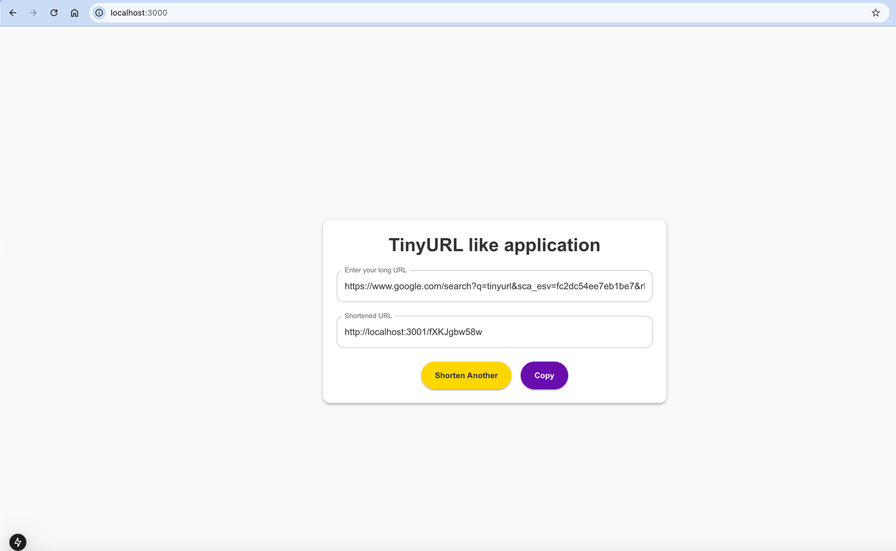

# Tiny URL Like Application

Why do we need in a first place a URL shortener such as [Tiny url](http://tinyurl.com) ? Simply put, it allows us to 
shorten long URLs and make message more concise and also save a lot of space when used in social media like tweeter 
where messages are constrained in terms of size. When a user hit the shortened url it is redirected to the original URL.

However, behind this simplicity, lies many technical challenges. For example:
* 💎 How do we generate a short URL?
* 💎 How do we ensure that short URL that is unique and does not collide with other URLs ?
* 💎 How do we store the mapping between the short URL and the original URL ?
* 💎 How do we handle high traffic and ensure that the service is scalable ?

This repository contains a simple implementation of a URL shortener service. It is not meant to be a production-ready 
service, but rather a proof of concept to demonstrate the basic functionality of a URL shortener. In addition, a system
design document is provided to explain the design choices made in the implementation. 

Happy learning 😎 !

# 📖 Table of contents

* 🛠 [How to run the application locally](docs/how-to-build-run-the-app-locally.md)
* 📐 [System design](docs/system-design.md)
* 🔦 [Testing strategy](docs/testing-strategy.md)
* 📘 [References](docs/references.md)