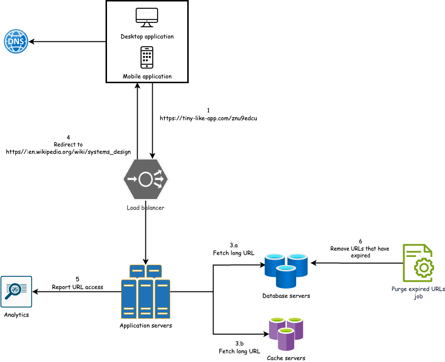

# 🧱 Propose high-level design

The design is divided into two parts: Generate a short URL and redirect to the long URL.

## Generate a short URL

1. **User submits a long URL**: The user sends a request to shorten a long URL through the system’s 
interface (e.g., web or mobile).
2. **Request routed via Load Balancer**: The load balancer distributes incoming traffic across multiple application 
servers, ensuring high availability, fault tolerance, and scalability.
3. **Application Server generates short URL**: The selected application server processes the request, generates a 
unique short URL and stores the mapping in the database.
4. **Short URL is returned to the user**: The server responds with the newly created short URL, which the user can now 
share and use for redirection.

## Redirect to the long URL

1. **User clicks on short URL**: The user clicks on the short URL, which is routed to the system.
2. **Request routed via Load Balancer**: The load balancer distributes the incoming request to one of the application 
servers.
3. **Application Server retrieves long URL**: The application server first checks the cache for the corresponding long URL.
   * If found in the cache, it retrieves the long URL and proceeds to redirect the user.
   * If not found, it queries the database. If the URL exists, it is returned and cached for future use.
   * If the short URL is not found in either the cache or the database, the server responds with a 404 Not Found error.
4. **User is redirected to long URL**: The application server issues an `HTTP 302 redirect`, forwarding the user to the 
original long URL. **This temporary redirect ensures that the browser does not cache the response, allowing the system to 
track each request for analytics purposes**.
5. **Analytics and tracking**: The system logs each click event, capturing metadata (such as timestamp, IP, user agent, 
etc.) for analytics and monitoring.
6. **Expired URL cleanup**: A background job periodically scans the database for expired short URLs (valid for one year 
by default) and removes them to reclaim storage and maintain system health.